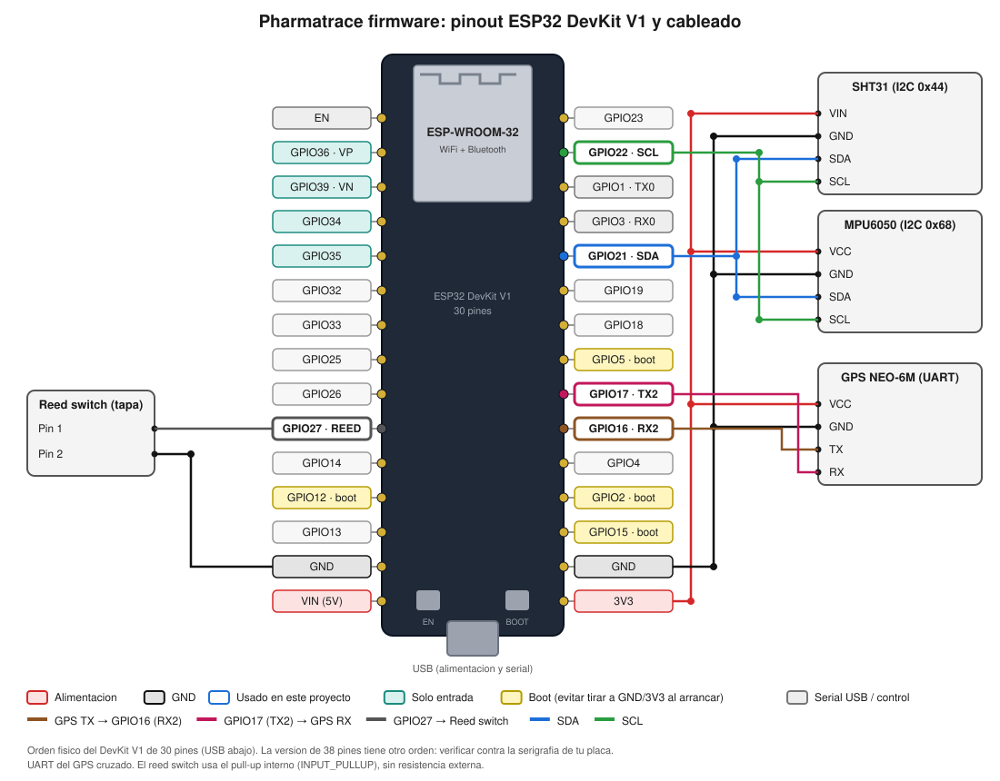

# pharmatrace-firmware

Firmware de la valija IoT de cadena de frío para [Pharmatrace](https://github.com/gastonhp1/Pharmatrace).

La valija sensa el estado del lote durante el transporte (temperatura, humedad, apertura, golpes, ubicación) y reporta lecturas firmadas que terminan registradas en los contratos inteligentes de Pharmatrace.

## Estado

Scaffolding inicial. Nada de esto está validado en hardware todavía.

## Supuestos (a confirmar)

- MCU: **ESP32** (DevKit v1 para prototipar)
- Toolchain: **PlatformIO** + framework Arduino
- Sensores previstos: temperatura/humedad (SHT31 o DS18B20), reed switch de tapa, acelerómetro (golpes), GPS
- Transporte: WiFi/LTE → MQTT o HTTPS hacia un backend/oráculo. El ESP32 **no** habla directo con la blockchain.

## Estructura

```
include/config.h      Pines, intervalos y umbrales
src/main.cpp          Ciclo principal: sensar → evaluar → reportar
docs/architecture.md  Flujo de datos y decisiones de diseño
docs/wiring.svg       Diagrama de cableado
platformio.ini        Entorno de build
```

## Cableado



Los pines salen de `include/config.h`. El diagrama respeta el orden físico del ESP32 DevKit V1 de **30 pines** (USB abajo); la versión de 38 pines tiene otro orden, así que verificá cada GPIO contra la serigrafia de tu placa antes de soldar. Los pines marcados como *boot* (GPIO2, 5, 12, 15) condicionan el arranque: no conviene forzarlos a un nivel externo.

| Módulo | Pin del módulo | ESP32 |
|---|---|---|
| SHT31 / MPU6050 (comparten bus I2C) | VIN / VCC | 3V3 |
| | GND | GND |
| | SDA | GPIO21 |
| | SCL | GPIO22 |
| GPS NEO-6M | VCC | 3V3 |
| | GND | GND |
| | TX | GPIO16 (RX2) |
| | RX | GPIO17 (TX2) |
| Reed switch (tapa) | Pin 1 | GPIO27 |
| | Pin 2 | GND |

Notas:

- El UART del GPS va cruzado: TX del GPS a RX del ESP32 y viceversa.
- El reed switch no lleva resistencia externa porque el firmware configura `INPUT_PULLUP`.
- SHT31 y MPU6050 comparten el bus I2C con direcciones distintas (0x44 y 0x68). Las placas breakout suelen traer los pull-ups; si armás el bus con los chips pelados, hay que agregarlos.
- En variantes con PSRAM (ESP32-WROVER) los GPIO16 y GPIO17 están ocupados, así que este mapa de pines sirve para la WROOM-32.
- Si al final usás DS18B20 en lugar de SHT31, el diagrama cambia: va por 1-Wire y necesita un pull-up de 4.7 kΩ.

## Build

```bash
pip install platformio
pio run                 # compilar
pio run -t upload       # flashear
pio device monitor      # serial a 115200
```

## Relación con el repo principal

Pharmatrace es un monorepo (contratos, backend, frontend). Este repo es aparte porque el ciclo de build, flasheo y versionado del firmware es independiente.
